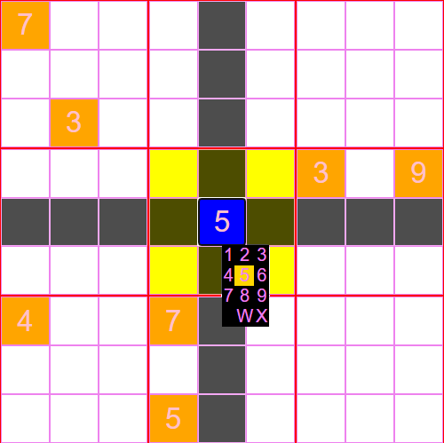
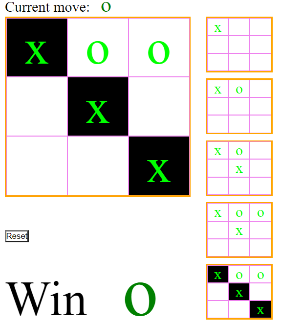

# Mini-projects for progressing skills in development under the React framework

```
Install package:
    npm i
Run server in developer mode:
    npm run dev
```

<div style='color:green'>//server on http://localhost:3000</div>

## Sudoku

<br>

## Tic-Tac-Toe

<br>
